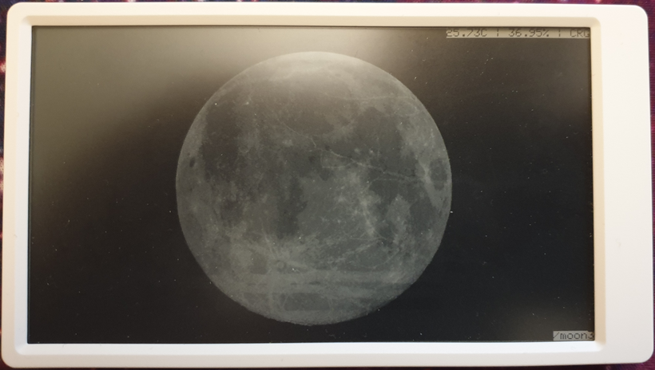

# Flip-Pics 

Aka, a Simple Picture Frame for the [M5Paper](https://m5stack.com/products/m5paper-esp32-development-kit-960x540-4-7-eink-display-235-ppi). 

This project contains:
* The flip-pics M5paper firmware needed to iterate across the SDcard at regular interval
* A go app that performs resize, rotation and proper naming for the images. The firmware barely display images, with this application we perform all steps in order to render correctly. It also encodes image information in the filename that the firmware picks it up. Image names are encoded `basename_widthxheight_offsetXxoffsetY.ext`.

## Prepare pictures to display

Prepare a folder with all the images you want to display on the M5paper.
Use `resizer.go` to convert all those images to the appropriate format/size. You can use as `output` folder the SDcard directly.

```
$ cd resizer ; go run resizer.go -input ~/mypictures/ -output /media/sdcard/
2020/12/20 21:31:37 Processing image from /home/user/mypictures/gos/, resizing into /tmp/gos/
2020/12/20 21:31:37 Processing /home/user/mypictures/gos/2015-10-10 20.06.59.jpg
2020/12/20 21:31:37 Resized from 3264x2448 to 720x540
2020/12/20 21:31:37 Created new image 2015-10-10 20.06.59_720x540_120x0_resized.jpg
2020/12/20 21:31:37 Processing /home/user/mypictures/gos/2015-10-17 11.15.07.jpg
2020/12/20 21:31:37 Resized from 1280x960 to 720x540
...
```

## Deploy 

This project is built for [PlatformIO](https://platformio.org/) and can be deployed directly from the IDE by pressing `Build` and `Upload` from the PlatformIO tasks. 

> You can configure the refresh interval by modifying the `SLEEP_HOURS` define.

## Enjoy



> **NOTE** when the cable is attached, the M5paper won't shutdown and you can iterate the images by pressing the side buttons.